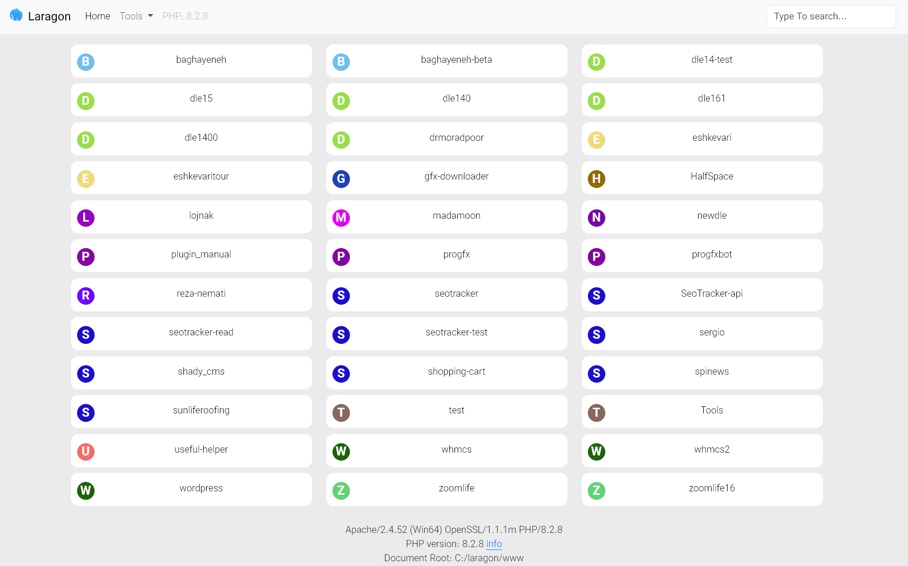

# Laragon Index Page Theme

> This repository contains a custom theme for the Laragon index page that enhances its functionality and aesthetic appeal. The theme is built with Bootstrap 5.3.1 and provides a visual representation of all directories and files, with the first character of each folder used as an icon. It also features an instant search functionality for ease of navigation



## Features

- Displays directories and files with folder icons.
- Instant search functionality to quickly find directories and files.
- Built with Bootstrap 5.3.1 for a responsive and modern design.


## Installation

1. Clone the repository:

   ```shell
   git clone https://github.com/mr-shady/laragonTheme
   ```
2. Copy the theme files to your Laragon installation directory:
    ```shell
    cp -R laragonTheme/* laragon/www/
    ```
3. Open Laragon and access the index page in your browser.

## Usage

The theme automatically scans the directories and files in your Laragon installation directory and displays them on the index page. You can use the following features:

- **Folder Icons**: Each folder is displayed with an icon representing the first character of the folder name.
- **Instant Search**: Use the search bar at the top of the page to quickly search for directories and files.

## Customization

You can customize the theme by modifying the following files:

- index.php: The main php file for the index page.
- bootstrap-5.3.1/custom.css: Custom CSS styles for the theme.

## Contributing

Contributions are welcome! If you find any issues or have suggestions for improvements, please open an issue or submit a pull request.

## License

This project is MIT licensed.

## Acknowledgements

- [Laragon](https://laragon.org/)
- [Bootstrap](https://getbootstrap.com/)
