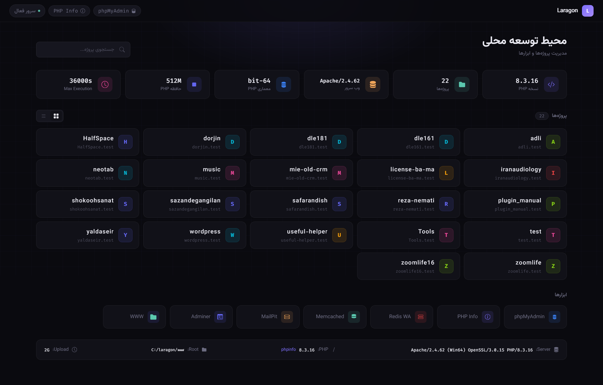

# Laragon Modern Index Theme

A modern and lightweight replacement for the default Laragon index page with a clean dark UI, instant project search, project statistics, quick development tools access, and direct folder opening support for Windows.



---

## Features

### Modern Dashboard UI
- Clean dark interface inspired by modern developer dashboards.
- Fully responsive layout for desktop and mobile.
- RTL (Persian/Farsi) interface support.
- Animated hover effects and smooth transitions.

### Project Management
- Automatically scans all directories inside `www`.
- Displays each project with:
  - Custom colored avatar
  - Project URL
  - Quick access button
- Grid and list view modes.
- Instant live search for projects.
- Project counter with dynamic filtering.

### Quick Folder Access
- Open project folders directly in Windows Explorer.
- Open the root `www` folder from the dashboard.
- Includes validation to prevent path traversal attacks.

### Development Tools Shortcuts
Quick access cards for:
- phpMyAdmin
- PHP Info
- Redis Web Admin
- Memcached
- MailPit
- Adminer

### Environment Information
Displays useful runtime information:
- PHP version
- PHP architecture (32-bit / 64-bit)
- PHP memory limit
- Max execution time
- Web server information
- Document root path
- Upload limit

### Security Improvements
- Directory validation before opening folders.
- Prevents invalid path injection.
- Safe handling of directory names.

---

## Requirements

- Laragon
- PHP 7.4+
- Windows (folder opening feature uses `explorer.exe`)

---

## Installation

### 1. Clone the repository

```bash
git clone https://github.com/mr-shady/laragonTheme
```

### 2. Copy files into Laragon

Copy the contents into your Laragon `www` directory:

```bash
cp -R laragonTheme/* laragon/www/
```

Or manually replace your existing `index.php` file.

### 3. Restart Laragon

Restart Laragon and open:

```text
https://localhost
```

---

## Configuration

Inside `index.php` you can customize the local domain postfix:

```php
$DomainPostFix = 'test';
```

Example generated URL:

```text
https://project-name.test
```

---

## Usage

### Search Projects
Use the search input to instantly filter projects.

### Change View Mode
Switch between:
- Grid View
- List View

### Open Project Folder
Click the folder icon on a project card to open the directory directly in Windows Explorer.

### Open Root WWW Folder
Use the `WWW` tool card or project statistics card to open the Laragon root directory.

---

## Built-in Endpoints

### PHP Info

```text
/?q=info
```

Displays the PHP configuration page.

### Open Folder

```text
/?q=open&dir=project-name
```

Opens the selected project folder in Windows Explorer.

---

## Customization

You can customize:

- Colors from the CSS `:root` variables.
- Tool shortcuts inside the tools section.
- Typography and spacing.
- Project URL postfix.
- Card styles and animations.

Main customization file:

```text
index.php
```

---

## Technologies Used

- PHP
- Vanilla JavaScript
- Modern CSS
- Google Fonts (`Vazirmatn` and `Fira Code`)

---

## Security Notes

The folder open feature validates directory names using regex:

```php
/^[a-zA-Z0-9_\-\.]+$/
```

This prevents:
- Path traversal
- Invalid directory access
- Arbitrary path injection

---

## Contributing

Contributions, issues, and pull requests are welcome.

If you have ideas for improvements, feel free to open an issue.

---

## License

MIT License

---

## Acknowledgements

- Laragon
- phpMyAdmin
- MailPit
- Adminer

